## 第二章	Java 环境搭建及体验程序

### 2.1	JDK 安装

- 在浏览器上搜索 Java Archive ，根据操作系统找到相应下载源
- 双击安装文件，修改目录，一路 Next
- 配置 JAVA_HOME 环境变量
- 配置 Path 环境变量
- 不要在环境变量中配置 classpath ，如果有，也请删除

**Tip ：**可以设一个专门目录放 Java 文件。例如 d: java ，然后将后续所有 Java 程序和文件都可放置于此目录下。

- 双击 exe 进入安装界面，点击下一步

- 更改”切换 JDK 安装路径

- 更改”切换 JRE 的安装路径

- 点击“关闭”完成安装，后续步骤可以忽略

**配置系统环境变量**

- 右键“我的电脑” 系统属性或“此电脑”系统属性 高级系统设置，点击“环境变量”按钮

**注意：** Win 系统环境变量设置优先级大于用户变量

- 新建 JAVA_HOME 环境变量，填入 JDK 路径

- 编辑 Path 环境变量，增加 %JAVA_HOME%\ bin；

- 设置好环境变量后，再打开新的 cmd 窗口使用java -version或javac命令进行测试

**总结**

- JDK 是开发和运行 Java 程序的必备工具
- javac.exe 编译
- java.exe 运行
- 根据操作系统版本选取合适的 JDK 进行安装
- 需要配置 JAVA_HOME 和 PATH 两个环境变量

### 2.2	Eclipse 安装

**编写java程序的工具**

- 记事本 /vi 提供文件编辑功能
- 增强型记事本： Ultraedit/Editplus/notepad++/Sublime ，提供回退、关键词高亮、批量操作等辅助功能
- 集成开发环境（ IDE, Integrated Development Environment提供多文件管理、编译、调试等功能

**什么是IDE 集成开发环境**

- 相当于一口锅或者一个电饭煲的功能
- 本身没有能源 ，但可接入能源
- 提高编程操作效率

**可以使用IDE做什么**

- 创建工程
- 编写/格式化代码
- 编译运行
- 调试
- 发布

**安装Eclipse**

- 下载 eclipse 的安装包，解压到 d: java eclipse 目录即可

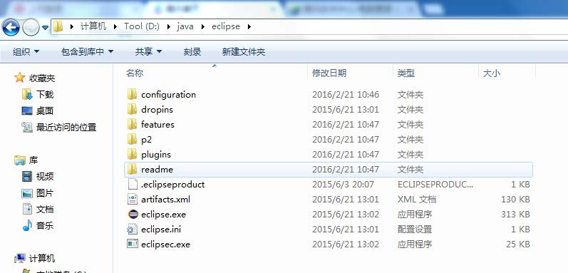

- 双击 eclipse.exe ，首先进入工作空间workspace配置（一个工作空间可以包含多个 project）

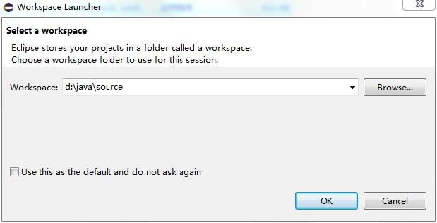

- 即可进入正常 IDE 界面

- 新建一个工程项目 (Java Project): first

- 右击 first 项目的 src 目录，新建一个 class

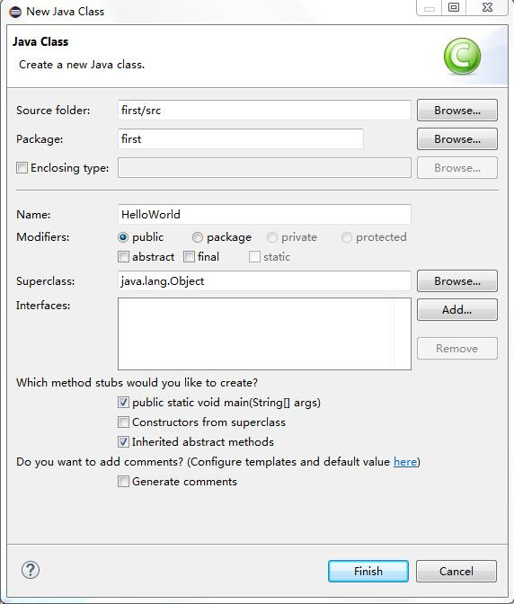

- 输入 HelloWorld 程序内容

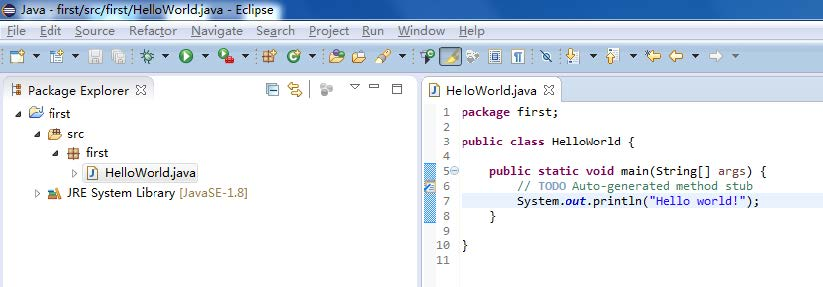

**总结**

- 对于大多数开发者，使用 IDE 效率更高
- IDE 没有优劣之分，根据自身和团队能力选择
- IDE 使用可以精通，但不能忘记 Java 原始的编译和运行方法

### 2.3	Eclipse 配置和调试

- 双击 eclipse.exe ，首先进入工作空间配置，如果输入不同的地址，将进入不同的 workspace

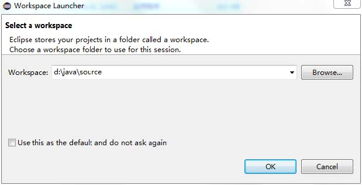

- 进入正常 IDE 界面

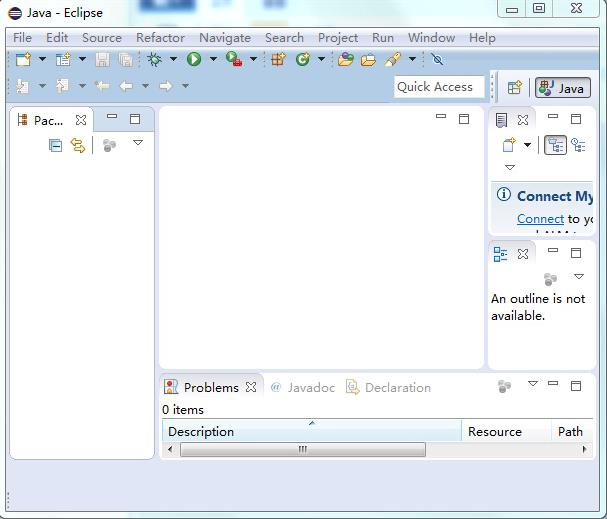

- 新建一个工程 first

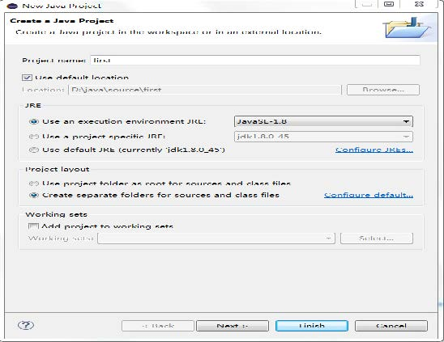

- 右击 first 项目的 src 目录，新建一个 class

- 输入 HelloWorld 程序内容

- Eclipse 的主要配置界面 Windows -->Preference

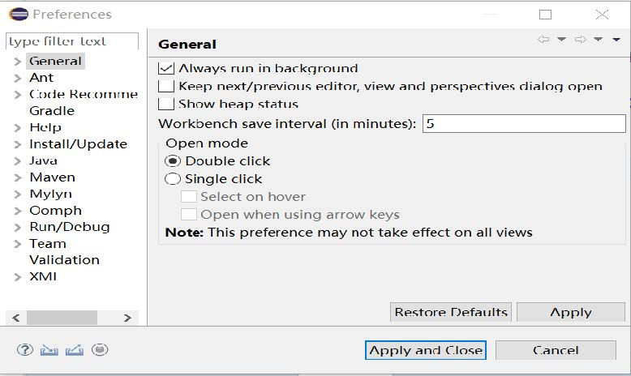

- 调整 Eclipse 编程界面的字体大小

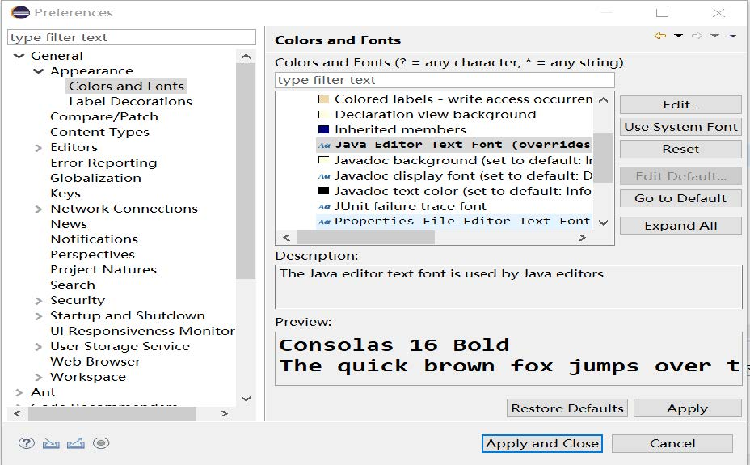

- 调整 Eclipse 以显示程序行号

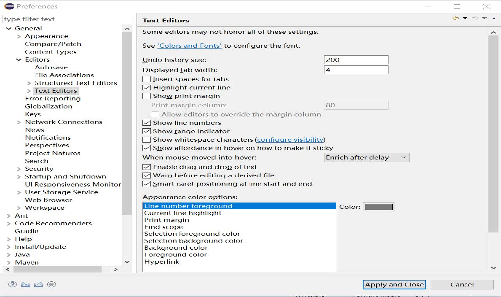

- 调整 Eclipse 自动保存时间和默认文本编码

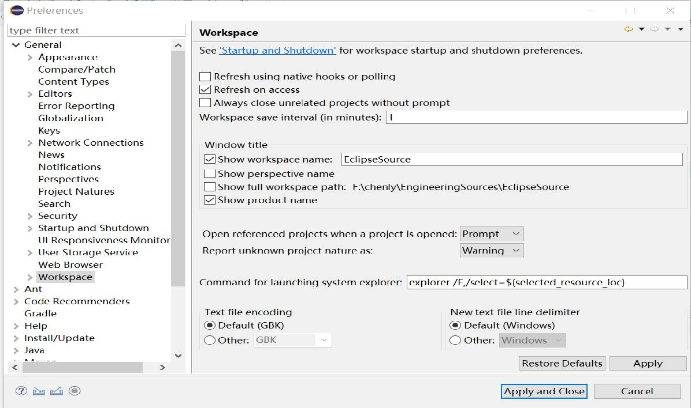

- 调整 Eclipse 默认编译级别

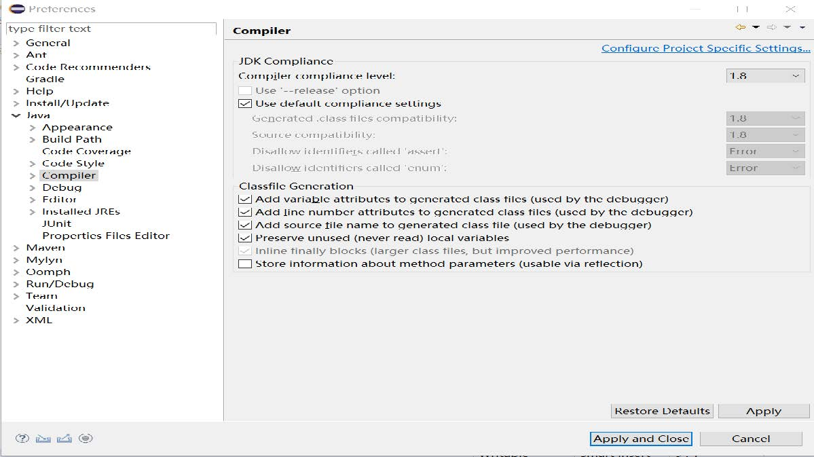

- 查看 Eclipse 配置的 JDK 信息

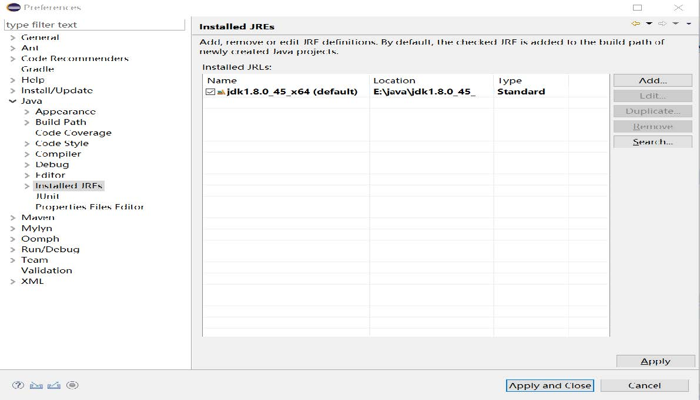

- 格式化代码

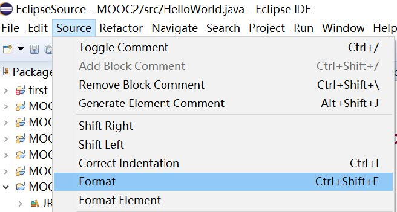

- 重置窗口布局

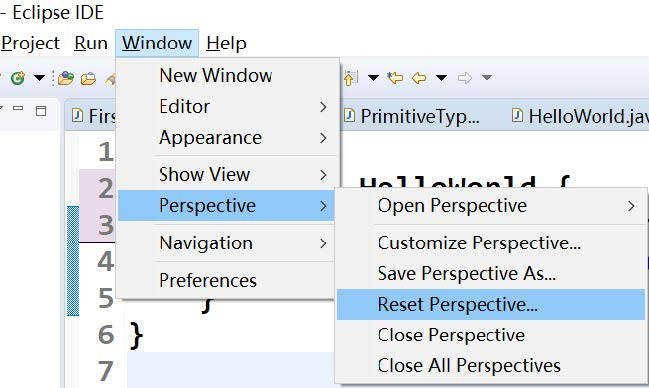

- 双击第五行行首 蓝色区域，可以设置断点

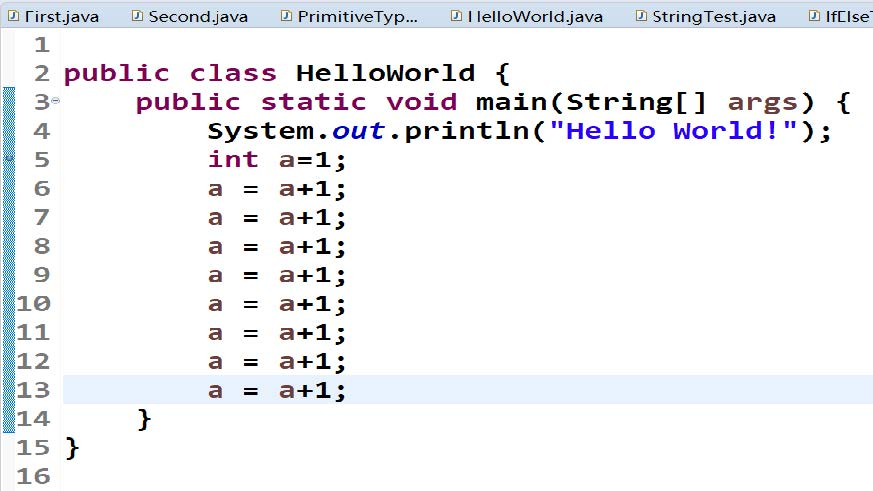

- 设置断点后，右键程序，选择 Debug 运行进入调试

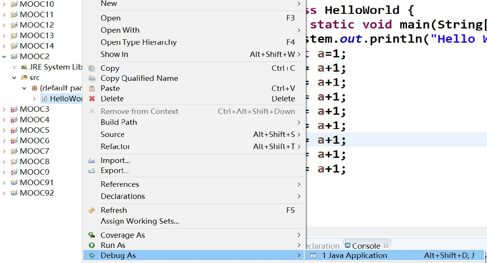

- 单步调试程序，查看中间变量值

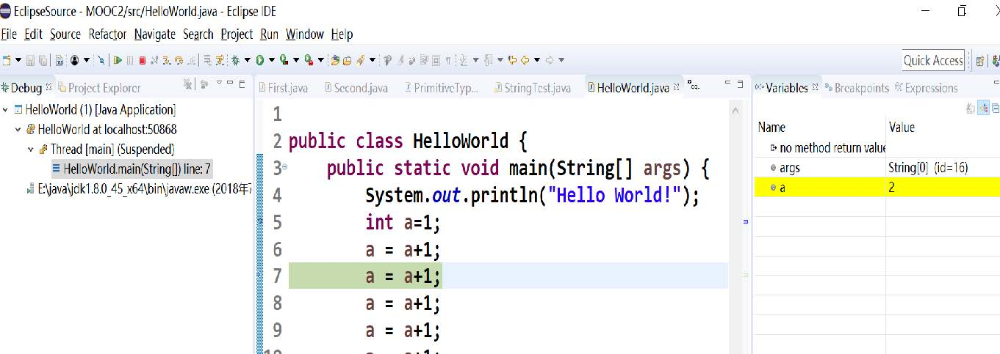

**总结**

- 界面设置和调整
- JDK 管理和代码编译
- 程序单步调试

**推荐：** 极客学院的 Eclipse 的教程http://wiki.jikexueyuan.com/project/eclipse/

### 2.4	程序编写、编译和运行

**编写：**利用记事本 /vi/IDE 等完成代码文件编写

**编译：**利用 JDK 中 javac.exe 将代码编译成字节码文件

- 默认在保存的时候，就进行编译，或者整个项目编译，产生字节码文件 .class 文件 不是 .exe 文件
- 字节码文件是平台无关的，可以在多个平台分发运行

**运行：** java.exe 读入并解释字节码文件 (.class) ，最终在 JVM 上运行

**程序编写需要遵循编码标准**

- 类名首字母大写，后面单词驼峰命名
- 方法名和变量名首字母小写，后面单词驼峰命名

**对目录d: java source HelloWorld.java文件的编译方式**

- javac HelloWorld.java 在 HelloWorld.java 文件所在的当前目录下
- x:\\> javac d: java source HelloWorld.java // 或者在任意位置

**JDK 有 32 位和 64 位之分**

- 32 位操作系统只能装 32 位的 JDK
- 64 位操作系统可以装 32 位或者 64 位的 JDK
- 32 位和 64 位，编译和执行命令可以混用

**JDK 有版本高低之分**

- 高版本编译的文件，低版本是不可以执行的，会报告java.lang.UnsupportedClassVersionError 错误
- 低版本编译的文件，高版本会兼容、会执行

**总结**

- Java 程序编写、编译和运行
- 集成 IDE 在程序编写方面有较大优势
- 编译依靠 javac.exe ，运行依靠 java.exe
- 编译和运行要注意版本的统一
